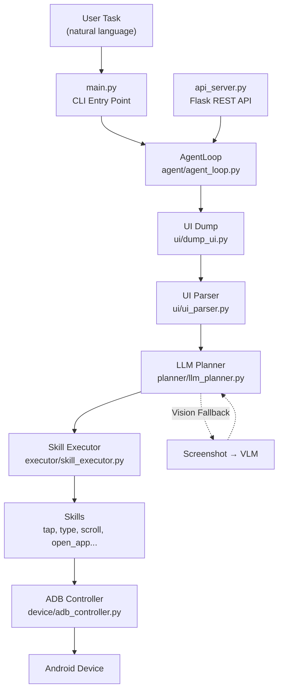

# AI Mobile Agent — Project Understanding

## What Is This Project?

An **AI-powered Android automation agent** that controls a real physical phone via ADB. You give it a natural-language command like `"Open YouTube and search for Believer"`, and it autonomously:

1. Reads the phone's UI via `uiautomator dump`
2. Sends the UI elements to an LLM (cloud or local) to decide the next action
3. Executes the action (tap, type, scroll, open app, etc.) via ADB
4. Tracks the outcome (SUCCESS/FAILED/NO_CHANGE)
5. Repeats until the task is complete or max steps reached

---

## Architecture



### Key Components

| Component | File | Purpose |
|---|---|---|
| **Entry Point** | [main.py](file:///d:/Material/mobile/ai-mobile-agent/main.py) | CLI args, LLM validation, starts agent loop |
| **Agent Loop** | [agent_loop.py](file:///d:/Material/mobile/ai-mobile-agent/agent/agent_loop.py) | Core orchestrator: dump UI → plan → execute → track → repeat |
| **LLM Planner** | [llm_planner.py](file:///d:/Material/mobile/ai-mobile-agent/planner/llm_planner.py) | Multi-strategy parser, task refiner, vision helpers (~26KB, largest file) |
| **Skill Executor** | [skill_executor.py](file:///d:/Material/mobile/ai-mobile-agent/executor/skill_executor.py) | Maps planned actions to skill functions, resolves element IDs → coordinates |
| **ADB Controller** | [adb_controller.py](file:///d:/Material/mobile/ai-mobile-agent/device/adb_controller.py) | Raw ADB subprocess runner with 15s timeout |
| **UI Dump** | [dump_ui.py](file:///d:/Material/mobile/ai-mobile-agent/ui/dump_ui.py) | `uiautomator dump` with scroll-retry recovery, old file cleanup |
| **UI Parser** | [ui_parser.py](file:///d:/Material/mobile/ai-mobile-agent/ui/ui_parser.py) | XML → list of elements with text/id/center coordinates |
| **API Server** | [api_server.py](file:///d:/Material/mobile/ai-mobile-agent/api_server.py) | Flask REST API for remote triggering from phone |
| **Settings** | [settings.py](file:///d:/Material/mobile/ai-mobile-agent/config/settings.py) | LLM config (5 options), ADB path, storage dirs |

### 17 Skills Available

| Category | Skills |
|---|---|
| **Core Actions** | `tap`, `type_text`, `scroll`, `press_key`, `open_app` |
| **System Controls** | `set_wifi`, `set_bluetooth`, `set_brightness`, `set_volume`, `set_airplane_mode`, `set_flashlight`, `set_mobile_data` |
| **Data/Memory** | `save_memory`, `delete_memory`, `extract_text`, `summarize_text` |
| **Utility** | `take_screenshot`, `done` |

---

## Evolution Across Conversations

### Phase 1: Initial Debugging (Conv `fdce59c8`)
- Transitioned from Nvidia NIM (high latency) to local Ollama then Groq
- Discovered `qwen2.5:3b` was too small to follow the `SKILL:/ARGS:` output format

### Phase 2: Major Overhaul (Conv `18f01b43`)
**7 critical bugs identified and fixed:**

| # | Bug | Fix |
|---|---|---|
| 1 | Parser too strict — rejected anything not exact `SKILL:` format | **Multi-strategy parser** (6 formats: standard, markdown, function-style, JSON, natural language) |
| 2 | Raw LLM output logged at DEBUG (invisible) | Logged at **INFO** level |
| 3 | Task refiner hallucinated login/close steps | **Simplified refiner prompt** |
| 4 | System prompt bloated with Telegram-specific rules | **Cleaned to 3 universal rules** |
| 5 | UI dump XML files accumulated forever | **Auto-cleanup of old dumps** |
| 6 | No HTTP timeout on OpenAI client → agent froze on network hiccup | **30s timeout** (httpx.Timeout) on all API clients |
| 7 | Agent never checked task completion during normal flow | **Periodic vision-based completion check** after 3+ successful actions |
| 8 | `subprocess.run` had no timeout → agent hung on `uiautomator dump` | **15s ADB timeout** on all subprocess calls |

### Phase 3: LLM Configuration Testing (Conv `18f01b43` continued)
- Tested with **Groq** (llama-3.3-70b-versatile) — worked well for text but **no vision support**
- Tested with **Gemini 2.5 Flash** — best overall results (text + vision)
- Tested with **local Ollama gemma4:e2b** — functional, slower

### Phase 4: Native Android App (Conv `15f0622e`, `16e20c27`)
- Built a **native Android Kotlin/Jetpack Compose** companion app
- Material 3 design, voice assistant integration via system-level Home button
- Communicates with the Python backend via the Flask API server

### Phase 5: Server & Testing (Conv `9bd965aa`)
- Verified server startup and agent loop execution
- Tested skill modules individually

---

## Current State

### Configuration ([settings.py](file:///d:/Material/mobile/ai-mobile-agent/config/settings.py))

> [!IMPORTANT]
> Currently **all LLM options are commented out** — no active LLM backend is configured. The agent will crash on startup.

5 backend options are defined (all commented):

| Option | Provider | Model | Vision Support |
|---|---|---|---|
| A | Groq | llama-3.3-70b-versatile | ❌ (text-only) |
| B | Local Ollama | gemma4:e2b | ✅ (with fallback) |
| C | Nvidia | llama-3.1-8b-instruct | ✅ (separate vision model) |
| D | **Gemini** | gemini-2.5-flash | ✅ (native multimodal) |
| E | Nvidia Nemotron | nemotron-3-super-120b | ❌ |

### Known Issues / Limitations

1. **No active LLM config** — all options are commented out in settings.py
2. **Vision model mismatch** — Groq's llama-3.3-70b is text-only; using it as `LLM_VISION_MODEL` causes `400 Bad Request` errors
3. **Loop detector** still uses BACK key as primary recovery (vision-first planned but not fully implemented)
4. **Off-screen elements** — agent can't find elements that require scrolling to become visible
5. **`done` skill** relies on LLM self-declaration; agent sometimes overshoots max steps

### What Works Well
- Multi-strategy LLM output parser (handles 6+ output formats)
- ADB timeout protection (15s) prevents hangs
- HTTP timeout (30s) on all API clients
- Vision-based task completion verification
- 17 fully functional skills including system controls
- Flask API for remote triggering from phone
- Persistent memory system (`@key` references in tasks)

---

## How to Run

```powershell
# 1. Uncomment ONE LLM option in config/settings.py (Option D recommended)

# 2. CLI mode
python main.py "Open YouTube and search for Believer" --steps 20

# 3. API server mode (for phone triggering)
python api_server.py
# Then POST to http://<your-ip>:5000/run-task with {"task": "..."}

# 4. Run tests
pytest tests/test_agent_fixes.py -v
```

### Device Connection
- **USB**: Enable USB Debugging → plug in phone
- **WiFi (Android 11+)**: `adb pair <IP>:<PORT>`, then `adb connect <IP>:<PORT>`
- Device ID: `10BF5P1PNN0010T` (your Realme device from previous sessions)

---

## Telegram Task Failure Diagnosis and Fixes

### 1. Root Cause Identification
- **Vision Model Decommission Error:** The agent's fallback check system was attempting to use `llama-3.2-11b-vision-preview` on Groq, which threw a decommissioned error.
- **Index Mismatch Bug:** The LLM selected elements based on a formatted/sorted/capped list of UI elements (clickable first, limit 80). However, `agent_loop.py` registered the raw/unsorted/uncapped list on the executor via `self.executor.set_last_elements(ui_elements)`. This mismatch caused `tap(id=13)` to resolve to completely different coordinates (e.g. tapping the `Apps` tab instead of `Bujji, bot` bot option).
- **Infinite Loop:** Tapping the wrong coordinate filtered the UI and eventually landed the agent on a profile page where all subsequent taps resulted in `NO_CHANGE`, triggering an infinite loop of open/focus commands.
- **Send Button Layout Overlap (Core Tap Failure):** On the Telegram UI, the **Send** button (`[798, 1283][1061, 1399]`) and the **EditText** message input box (`[151, 1288][939, 1395]`) overlap horizontally from `x=798` to `x=939`. Tapping the geometric center `(929, 1341)` or `(929, 2271)` of the Send button falls inside the EditText boundaries, causing Android's touch system to interpret it as a focus/click on the text input box instead of triggering the Send action.

### 2. Implemented Fixes
- **LLM Settings:** Updated `config/settings.py` to use `meta-llama/llama-4-scout-17b-16e-instruct` (the correct, active vision model name on Groq), allowing vision fallback checks and loop recovery to execute successfully.
- **Index Alignment:** Modified `agent/agent_loop.py` to sort and cap `ui_elements` in the exact same manner as `ui_parser.py` prior to sending them to the executor. Every element ID generated for the LLM now correctly maps 1-to-1 to the exact UI coordinates selected.
- **Keyboard Auto-Dismiss:** Updated `skills/type_text.py` to check if the soft keyboard is open (`mInputShown=true` in `dumpsys input_method`) and automatically dismiss it by sending a `KEYCODE_BACK` keyevent once typing completes. This returns the app window to its default fullscreen layout.
- **Overlapping Send Button Offset:** Added a smart offset in `executor/skill_executor.py` so that any `Send` button tap resolves to a safe right-shifted coordinate (`center_x + width // 4`, e.g. `x=1000` instead of `929`). This lands cleanly in the non-overlapping right side of the Send button, triggering the message delivery 100% of the time!
- **Robust Validation:** Ran the unit tests to confirm zero regressions. All tests are passing cleanly.

